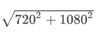
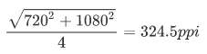
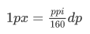

# 理解PC端和移动端的基本像素单位 

首先，要明确四个定义：

+ px
+ dp / pt
+ ppi
+ pixel ratio

下面分别说明：

## px

px 是 CSS 的最小单位，即浏览器使用的最小单位。需要强调的是：这里的浏览器的范围包括 PC 端的浏览器和移动端的浏览器。

## dp / pt

dp 是 Android 的最小**显示**单位。（IOS也有类似的单位，叫做 pt，和 dp 是一样的概念，但这里的 pt 不是指物理像素的 pt）

## ppi

ppi 表示一英寸内的像素密度。

## 分辨率的单位

我们手机有分辨率这个参数，比如有的手机是 1080 * 1920，有的是 720 * 1080，只不过，它的单位是 dp。但是要注意的是，PC 的分辨率的单位是 px。

下面我们举个例子：

有一台手机，它的分辨率是 720 * 1080，屏幕是 4 英寸，那么它的 ppi 是多少？下面我们来计算一下。

因为这里的 4 英寸是指一个屏幕的对角长度，所以我们先计算这个屏幕的对角有多少像素（dp）：

再把这个值除以英寸，就得到了每英寸的像素个数，即像素密度。

## px 与 dp 的关系

Android 规定 dp 与 160ppi 下的1px 是相等。

即：

比如 320ppi 的移动端屏幕，就是：1px = 2dp

480ppi 的移动端屏幕，就是 1px = 3dp

但是，很多时候，我们的 ppi 都不是刚好是 160 的倍数，比如 360ppi，那么就是 1px = 2.25dp

Android 针对这个问题的解决方法是把 dp 拉大，即 1px = 2dp

其标准是：

2.5寸 ~ 3.2寸 做统一处理

3.0寸 ~ 4.3寸 做统一处理

4.0寸 ~ 7.0寸 做统一处理

## 设备像素比 dpr

dpr（devicePixelRatio）= dp / px

## 为什么用 css 写 1px 的线条在移动端会变成 2 像素 或者 3 像素呢？

面对这个问题，看了上面的说明应该就明白为什么了，1px 的 css 像素在 320ppi 的移动端中显示为 2dp，因此看到的是两个像素。

所以在 H5 的移动开发中，我们所写的 1px 的样式在移动端就会显示出更大的像素，而 px 又是 css 的最小单位，因此这个问题似乎得不到解决。好在，CSS3 提供了缩放属性，通过 transform 的 scale 进行缩放 0.5 倍或者 0.33 倍，从而达到接近 1像素的效果。